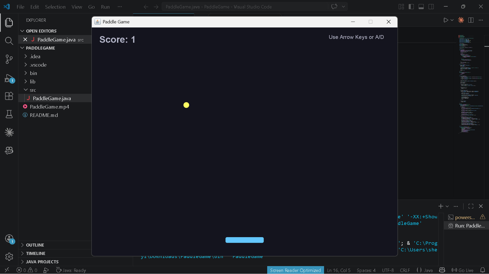
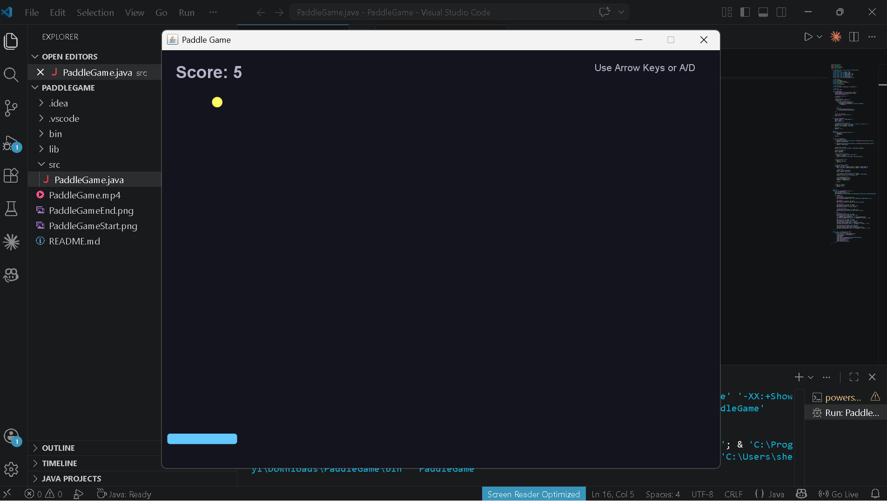
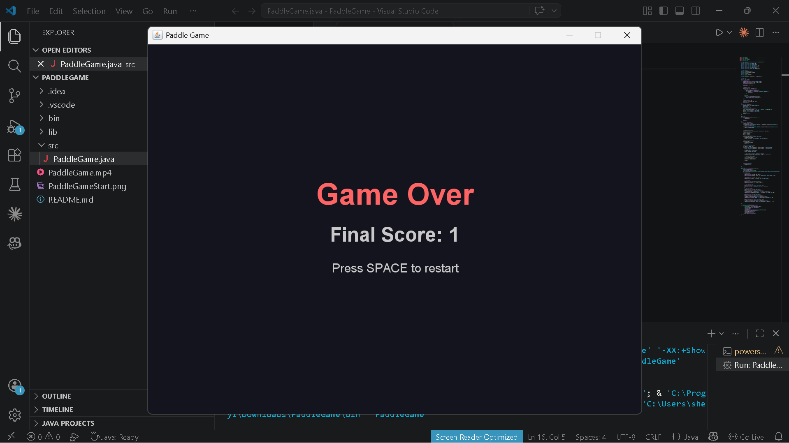

# Paddle Game (Java Swing)

This is a simple 2D paddle ball game developed using Java Swing. The project demonstrates basic game development concepts such as animation, collision detection, and keyboard input handling.

---

## Project Description

The game consists of a paddle controlled by the user and a moving ball. The objective is to keep the ball in play by bouncing it using the paddle. The score increases each time the ball hits the paddle. The game ends when the ball falls below the screen.

---

## Features

- Real-time game loop using Java Swing Timer
- Paddle movement using keyboard input (Arrow keys or A/D)
- Ball movement with basic physics and collision detection
- Score tracking system
- Game over screen when the ball is missed
- Restart functionality using SPACE key
- Simple graphical interface using Java 2D graphics

---

## Controls

- Left Arrow / A: Move paddle left
- Right Arrow / D: Move paddle right
- SPACE: Restart game after game over

---

## Screenshots

### Start Screen

### In Game

### Game Over Screen

---

## How to Run

1. Open the project in NetBeans or IntelliJ IDEA or VsCode
2. Make sure Java is installed on your system
3. Run the file `PaddleGame.java`
4. The game window will open and you can start playing

---

## Files Included

- PaddleGame.java - Main game source code
- PaddleGameStart.png - Start screen screenshot
- PaddleGameOnPlay.png - Gameplay screenshot
- PaddleGameEnd.png - Game over screenshot
- LICENSE - Project license
- .gitignore - Files ignored by Git

---

## Concepts Used

- Java Object-Oriented Programming (OOP)
- Java Swing GUI development
- Event handling (KeyListener, ActionListener)
- Game loop programming using Timer
- Collision detection
- Basic 2D graphics rendering

---

## Author

Name: Simamkele Sheyi  
Field: Computer Engineering  
Institution: CPUT
